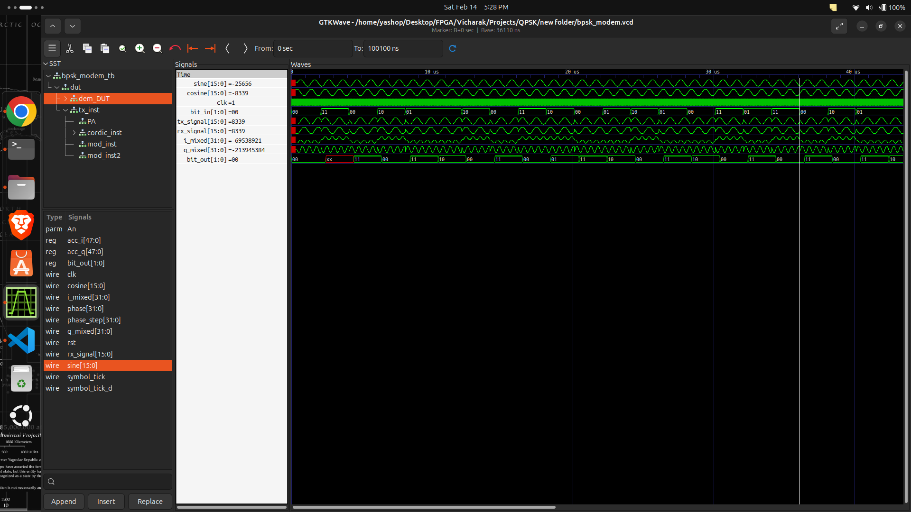

# QPSK Modem in Verilog

This repository contains a complete Quadrature Phase Shift Keying (QPSK) modem implemented in Verilog.
The design includes both transmitter and receiver chains and uses a Direct Digital Synthesis (DDS) carrier generator based on a phase accumulator and sine/cosine lookup tables.

The implementation is intended for FPGA-based digital communication experiments and RTL design evaluation.

---

## QPSK Principle

Quadrature Phase Shift Keying is a phase modulation technique in which two bits are transmitted per symbol using four distinct carrier phases.

A continuous-time carrier can be expressed as s(t) = A cos(2πfct).
In QPSK, the transmitted signal becomes s(t) = A cos(2πfct + θk), where θk ∈ {0°, 90°, 180°, 270°} depending on the input symbol.

Each symbol represents two bits:

00 corresponds to phase 0°   
01 corresponds to phase 90° 
11 corresponds to phase 180° 
10 corresponds to phase 270° 

QPSK transmits two bits per symbol, doubling the data rate compared to BPSK for the same bandwidth.

---

## System Description

The modem consists of a digital transmitter and receiver.

The transmitter converts the input bit pairs into I and Q components and modulates them onto orthogonal carriers using a DDS-based oscillator.
The receiver performs coherent demodulation by mixing the received signal with locally generated sine and cosine carriers and recovering the transmitted bits from the baseband I and Q components.

---

## Repository Structure

QPSK_modem/

* top_qpsk.v : Top-level modem integrating transmitter and receiver
* qpsk_tx.v : QPSK transmitter
* qpsk_rx.v : QPSK receiver
* symbol_mapper.v : Maps input bits to I and Q symbols
* symbol_detector.v : Detects received I and Q symbols
* nco.v : Phase accumulator used for DDS
* sine_cosine_lut.v : LUT-based sine and cosine generator
* mixer.v : Signal mixing block
* tb_qpsk.v : Testbench for full modem verification
* sim/ : Simulation-related files
* qpsk.vcd, qpsk_modem.vcd : Simulation waveforms

---

## Module Descriptions

### top_qpsk.v

Top-level integration module. It connects the transmitter, receiver, clock, reset, and internal data paths to form a complete modem.

### qpsk_tx.v

Implements the QPSK transmitter. The input bit pair controls the I and Q symbol polarity. The transmitter uses the phase accumulator to generate the carrier phase and the sine/cosine generator to produce the corresponding orthogonal waveforms.

### symbol_mapper.v

Converts input bit pairs into I and Q symbol values according to the QPSK constellation.

### nco.v

Implements the DDS phase accumulator. The phase is updated according to the discrete-time relation phase[n+1] = phase[n] + phase_step. This produces a digital oscillator whose frequency depends on the phase step value.

### sine_cosine_lut.v

Generates sine and cosine samples from the accumulated phase using lookup tables.

### mixer.v

Multiplies the I component with the cosine carrier and the Q component with the sine carrier to produce the QPSK signal.

### qpsk_rx.v

Implements the coherent QPSK receiver. The received signal is mixed with locally generated sine and cosine carriers, producing baseband I and Q components.

### symbol_detector.v

Determines the transmitted bit pair based on the polarity of the recovered I and Q signals.

### tb_qpsk.v

Testbench for verifying the correctness of the complete QPSK transmit and receive chain.

---

## Carrier Frequency Control

The carrier frequency is controlled by the parameter phase_step in nco.v.

The output frequency is given by the DDS relation
f_out = (phase_step × f_clk) / 2^N,
where f_clk is the system clock and N is the phase accumulator width.

Increasing phase_step increases the carrier frequency, while decreasing it lowers the frequency.

---

## Clock Frequency Changes

If the system clock changes, the phase step must be recalculated.
The scaling relation is
new_phase_step = old_phase_step × (new_clk / old_clk).

---

## Example Calculation

Assume a 50 MHz system clock, a 32-bit phase accumulator, and a desired carrier frequency of 1 MHz.
The required phase step is given by
phase_step = (1 MHz × 2^32) / 50 MHz ≈ 85899346.

---

## Simulation

Using Icarus Verilog:

Compile the design:
iverilog -o qpsk_sim *.v

Run the simulation:
vvp qpsk_sim

View the waveform:
gtkwave qpsk_modem.vcd

---

## Simulation Result :

The waveform shows the phase transitions corresponding to the input symbol sequence, confirming correct QPSK modulation and demodulation.

---

## FPGA Implementation

1. Synthesize top_qpsk.v.
2. Assign clock and reset pins.
3. Route the output to a DAC or GPIO.
4. Observe the waveform using measurement equipment.
   
--- 
The design has been verified through software simulation and FPGA implementation will be carried out in future work.
